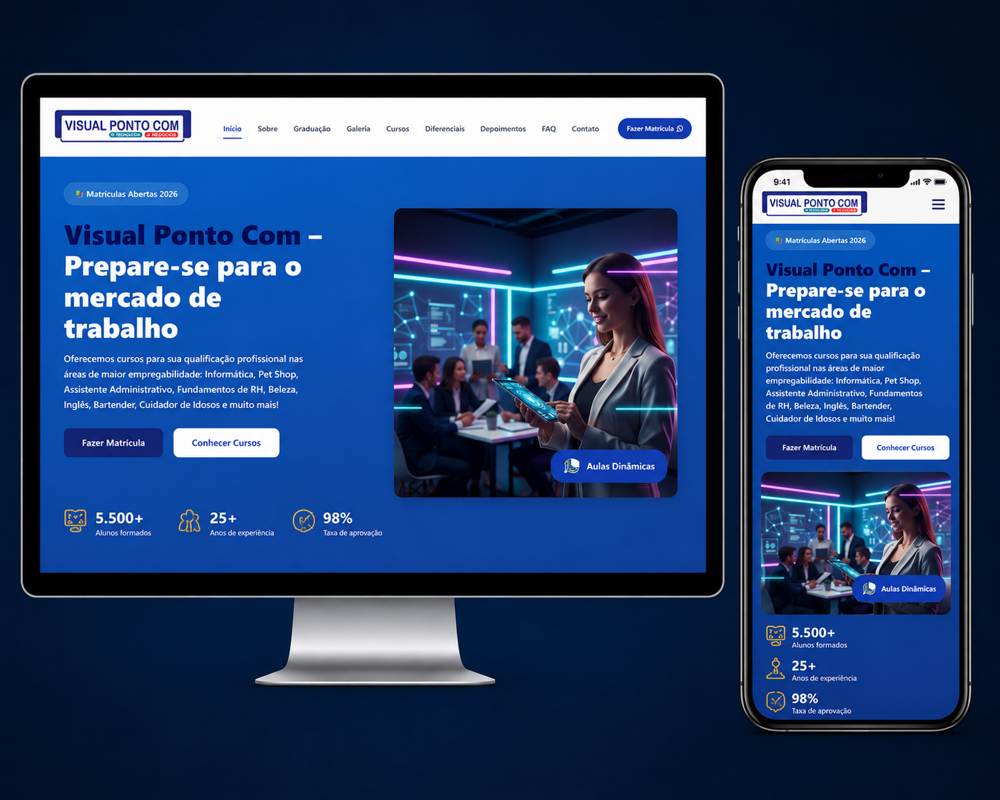

# Visual Ponto Com

Site institucional responsivo desenvolvido para a escola profissionalizante Visual Ponto Com, um cliente real. A página apresenta os cursos oferecidos, as unidades da escola e seus principais canais de atendimento.

- [Acessar o site](https://visualcursos.com.br/)
- [Ver meu portfólio](https://hiurysantos.github.io/portfolio-hiury/)

## Preview



## Sobre o projeto

A Visual Ponto Com precisava reunir sua apresentação institucional, seus cursos, suas unidades e seus canais de contato em uma presença digital acessível em diferentes dispositivos. O objetivo do projeto foi facilitar o acesso a essas informações e aproximar visitantes da equipe de atendimento.

Como solução, foi desenvolvido um site responsivo, sem frameworks, com navegação por seções, conteúdo sobre os cursos e as unidades, recursos interativos e integrações com WhatsApp, mapas e Google Analytics.

## Minha participação

Atuei em todo o ciclo do projeto:

- planejamento da solução;
- desenvolvimento da interface;
- adaptação responsiva;
- implementação das interações;
- testes;
- publicação;
- manutenção.

## Principais funcionalidades

- Layout responsivo, menu móvel e navegação entre seções;
- FAQ interativo e contadores animados;
- Galeria e mapas das unidades;
- Integração com WhatsApp e rastreamento dos cliques nos botões pelo Google Analytics;
- Animações durante a rolagem e efeito parallax;
- Carregamento tardio de imagens e botão para voltar ao topo;
- Metadados básicos de SEO.

## Tecnologias

- HTML5;
- CSS3;
- JavaScript;
- Google Analytics.

## Destaques técnicos

O projeto foi construído com HTML, CSS e JavaScript puro, sem dependência de frameworks. A interface se adapta a diferentes tamanhos de tela e inclui metadados básicos de SEO, carregamento tardio de imagens, integração com mapas das unidades e rastreamento dos cliques nos botões de WhatsApp por meio do Google Analytics.

## Como executar

O projeto não possui dependências ou etapa de compilação. Para executá-lo localmente, clone o repositório e abra o arquivo `index.html` diretamente no navegador. Se preferir um servidor de desenvolvimento local, abra a pasta em um editor compatível e utilize a extensão Live Server.

## Estrutura principal

```text
.
├── index.html
├── style.css
├── script.js
├── galeria.html
├── galeria.css
├── galeria.js
└── img/
```

## Autor

Hiury Ribeiro dos Santos

- Portfólio: [hiurysantos.github.io/portfolio-hiury](https://hiurysantos.github.io/portfolio-hiury/)
- LinkedIn: [linkedin.com/in/hiurysantos](https://www.linkedin.com/in/hiurysantos/)
- GitHub: [github.com/HiurySantos](https://github.com/HiurySantos)
